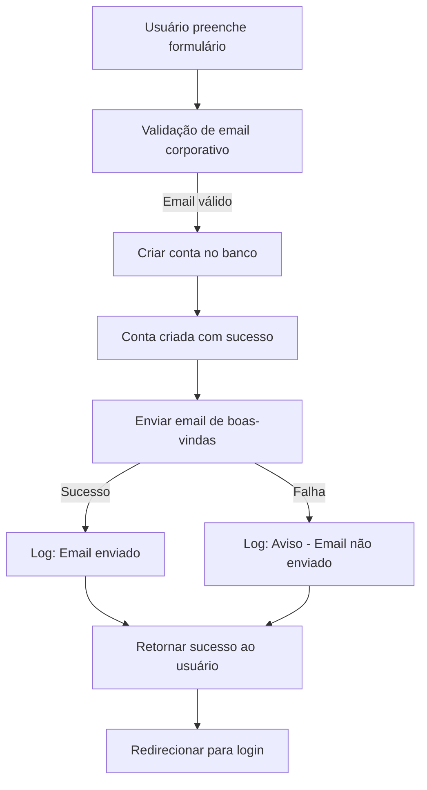

# 📧 EMAIL DE BOAS-VINDAS IMPLEMENTADO

**Data:** 14/10/2025  
**Status:** ✅ IMPLEMENTADO  
**Prioridade:** ALTA (Engajamento de usuários)

---

## 🎯 OBJETIVO

Enviar automaticamente um email de boas-vindas quando um novo usuário criar sua conta na plataforma SimplifiqueIA RH.

---

## ✅ BENEFÍCIOS

### **1. Experiência do Usuário**
- ✅ Confirmação imediata do cadastro
- ✅ Sensação de profissionalismo
- ✅ Reduz ansiedade ("meu cadastro funcionou?")
- ✅ Primeira impressão positiva

### **2. Engajamento**
- ✅ Guia os primeiros passos na plataforma
- ✅ Links diretos para funcionalidades principais
- ✅ Aumenta taxa de ativação
- ✅ Reduz abandono inicial

### **3. Segurança**
- ✅ Confirma que o email está correto
- ✅ Alerta sobre cadastros não autorizados
- ✅ Reforça confiança na plataforma

---

## 📧 CONTEÚDO DO EMAIL

### **Assunto:**
```
🎉 Bem-vindo ao SimplifiqueIA RH!
```

### **Estrutura:**

#### **1. Header com Gradiente**
- Fundo: Gradiente azul → roxo (cores da marca)
- Título: "🎉 Bem-vindo ao SimplifiqueIA RH!"

#### **2. Saudação Personalizada**
```
Olá [Nome do Usuário],

Sua conta foi criada com sucesso! 🚀

Estamos muito felizes em tê-lo(a) conosco. O SimplifiqueIA RH foi 
desenvolvido para transformar a forma como profissionais de RH trabalham 
com automação inteligente baseada em IA.
```

#### **3. Primeiros Passos (com links)**
```
🎯 PRIMEIROS PASSOS:

1. Criar seu primeiro agente
   → [Link para /builder]
   Use o construtor visual para criar agentes personalizados

2. Explorar templates prontos
   → [Link para /gallery]
   Análise de currículos, contratos, folha de pagamento e mais

3. Acessar seu perfil
   → [Link para /profile]
   Gerencie seus agentes e visualize seu histórico
```

#### **4. Dica em Destaque**
```
💡 DICA: Comece com o template de "Análise de Currículos" para ver o 
poder da plataforma em ação! Em poucos cliques você terá análises 
profissionais automatizadas.
```

#### **5. Recursos Úteis**
```
📚 RECURSOS ÚTEIS:

• Templates especializados para RH
• Processamento inteligente de documentos
• Geração automática de relatórios em PDF
• Suporte via email
```

#### **6. CTA Button**
```
[Botão: Começar Agora →]
```

#### **7. Suporte**
```
Qualquer dúvida, estamos à disposição em suporte@simplifiqueia.com.br

Equipe SimplifiqueIA RH 💙
```

#### **8. Footer**
```
Este email foi enviado porque você criou uma conta em SimplifiqueIA RH.
Se não foi você, por favor nos avise imediatamente.
```

---

## 🛠️ IMPLEMENTAÇÃO TÉCNICA

### **Arquivos Modificados:**

#### **1. `src/lib/email/email-service.ts`**

**Novo método adicionado:**
```typescript
async sendWelcomeEmail(
  userEmail: string, 
  userName: string
): Promise<{ success: boolean; messageId?: string; error?: string }>
```

**Funcionalidades:**
- ✅ Template HTML responsivo
- ✅ Versão texto simples (fallback)
- ✅ Links dinâmicos baseados em `NEXT_PUBLIC_APP_URL`
- ✅ Design profissional com gradientes
- ✅ Compatível com todos os clientes de email

---

#### **2. `src/app/api/auth/signup/route.ts`**

**Integração adicionada:**
```typescript
// 📧 ENVIAR EMAIL DE BOAS-VINDAS
try {
  console.log(`📧 [Signup] Enviando email de boas-vindas para: ${email}`);
  const emailService = getEmailService();
  const emailResult = await emailService.sendWelcomeEmail(email, name);
  
  if (emailResult.success) {
    console.log(`✅ [Signup] Email enviado! MessageId: ${emailResult.messageId}`);
  } else {
    console.warn(`⚠️ [Signup] Falha ao enviar email: ${emailResult.error}`);
    // Não bloqueia o cadastro se o email falhar
  }
} catch (emailError) {
  console.error(`❌ [Signup] Erro ao enviar email:`, emailError);
  // Não bloqueia o cadastro se o email falhar
}
```

**Características:**
- ✅ Envio assíncrono (não bloqueia cadastro)
- ✅ Logs detalhados para debugging
- ✅ Falha silenciosa (não impede cadastro)
- ✅ Tratamento de erros robusto

---

## 🔄 FLUXO COMPLETO



**Importante:** O email é enviado APÓS a conta ser criada, mas uma falha no envio NÃO impede o cadastro.

---

## 📊 DESIGN DO EMAIL

### **Características:**

#### **1. Responsivo**
- ✅ Funciona em desktop e mobile
- ✅ Largura máxima: 600px
- ✅ Layout adaptável

#### **2. Compatibilidade**
- ✅ Gmail (web e app)
- ✅ Outlook (web e desktop)
- ✅ Apple Mail
- ✅ Thunderbird
- ✅ Outros clientes populares

#### **3. Estilo**
- ✅ CSS inline (máxima compatibilidade)
- ✅ Gradientes modernos
- ✅ Cores da marca (azul → roxo)
- ✅ Tipografia legível
- ✅ Espaçamento adequado

#### **4. Elementos Visuais**
- ✅ Emojis para destaque
- ✅ Botão CTA com gradiente
- ✅ Seções bem definidas
- ✅ Links clicáveis
- ✅ Footer informativo

---

## 🧪 TESTES

### **Teste 1: Cadastro com Email Corporativo**

```bash
# 1. Acessar
http://localhost:3001/auth/signup

# 2. Preencher formulário
Nome: João Silva
Email: joao@empresa.com.br
Senha: senha123
Empresa: Empresa Teste
Cargo: Analista RH

# 3. Criar conta

# 4. Verificar logs do servidor
📧 [Signup] Enviando email de boas-vindas para: joao@empresa.com.br
📧 [EMAIL SERVICE] ===== INICIANDO ENVIO DE EMAIL =====
📧 [EMAIL SERVICE] Para: joao@empresa.com.br
📧 [EMAIL SERVICE] Assunto: 🎉 Bem-vindo ao SimplifiqueIA RH!
✅ [EMAIL SERVICE] Email enviado com sucesso!
✅ [Signup] Email de boas-vindas enviado com sucesso!

# 5. Verificar caixa de entrada
- Email deve chegar em 1-5 minutos
- Verificar pasta de spam se não aparecer
```

---

### **Teste 2: Falha no Envio (SMTP não configurado)**

```bash
# 1. Remover configuração SMTP do .env.local
# (comentar SMTP_HOST, SMTP_PORT, etc)

# 2. Criar nova conta

# 3. Verificar logs
⚠️ [Signup] Falha ao enviar email de boas-vindas: Configuração SMTP não encontrada

# 4. Verificar que cadastro funcionou
✅ Conta criada com sucesso
✅ Redirecionamento para login funciona
✅ Usuário pode fazer login normalmente
```

**Resultado:** Cadastro funciona mesmo sem SMTP configurado (graceful degradation).

---

## 📋 CHECKLIST DE VALIDAÇÃO

### **Funcionalidade:**
- [ ] Email enviado automaticamente após cadastro
- [ ] Nome do usuário aparece personalizado
- [ ] Links funcionam corretamente
- [ ] Botão "Começar Agora" redireciona para /builder
- [ ] Email de suporte correto (suporte@simplifiqueia.com.br)

### **Design:**
- [ ] Email renderiza corretamente no Gmail
- [ ] Email renderiza corretamente no Outlook
- [ ] Email renderiza corretamente no mobile
- [ ] Gradientes aparecem corretamente
- [ ] Emojis aparecem corretamente

### **Logs:**
- [ ] Log de início de envio aparece
- [ ] Log de sucesso/falha aparece
- [ ] MessageId é registrado
- [ ] Erros são capturados e logados

### **Robustez:**
- [ ] Cadastro funciona mesmo se email falhar
- [ ] Erro de SMTP não quebra a aplicação
- [ ] Timeout não trava o servidor
- [ ] Múltiplos cadastros simultâneos funcionam

---

## ⚙️ CONFIGURAÇÃO NECESSÁRIA

### **Variáveis de Ambiente:**

```env
# .env.local

# SMTP Configuration (SendGrid)
SMTP_HOST=smtp.sendgrid.net
SMTP_PORT=587
SMTP_SECURE=false
SMTP_USER=apikey
SMTP_PASS=SG.xxxxxxxxxxxxxxxxxxxxxxxxxxxxxxxxxxxxxxxxxxxxxxxxxxxxxxxxxxxxxxxx

# Email Settings
EMAIL_FROM=noreply@mail.simplifiqueia.com.br
EMAIL_FROM_NAME=SimplifiqueIA RH

# App URL (para links no email)
NEXT_PUBLIC_APP_URL=http://localhost:3001  # Desenvolvimento
# NEXT_PUBLIC_APP_URL=https://simplifiqueia.com.br  # Produção
```

---

## 🚀 PRÓXIMOS PASSOS

### **1. Configurar SendGrid (Pendente)**

```bash
# Passos:
1. Criar conta SendGrid (https://signup.sendgrid.com/)
2. Escolher plano FREE (100 emails/dia)
3. Autenticar domínio (Settings → Sender Authentication)
4. Adicionar registros DNS na Localweb
5. Aguardar verificação (2-24h)
6. Gerar API Key
7. Adicionar API Key no .env.local
```

---

### **2. Testar em Produção**

```bash
# Após deploy:
1. Criar conta de teste em produção
2. Verificar recebimento do email
3. Testar todos os links
4. Verificar se email não vai para spam
5. Validar com Mail Tester (meta: 10/10)
```

---

### **3. Monitorar Deliverability**

```bash
# Métricas a acompanhar:
- Taxa de entrega (delivery rate)
- Taxa de abertura (open rate)
- Taxa de cliques (click rate)
- Taxa de spam (spam rate)
- Bounces (emails rejeitados)
```

---

### **4. Warm-up do Domínio (Importante!)**

```bash
# Primeiros 7 dias:
Dia 1: 10 emails
Dia 2: 20 emails
Dia 3: 50 emails
Dia 4: 100 emails
Dia 5: 150 emails
Dia 6: 200 emails
Dia 7: 300 emails

# Motivo:
- Evitar ser marcado como spam
- Construir reputação do domínio
- Aumentar deliverability
```

---

## 📈 MÉTRICAS DE SUCESSO

### **Objetivos:**

| Métrica | Meta | Atual |
|---------|------|-------|
| Taxa de entrega | >95% | - |
| Taxa de abertura | >30% | - |
| Taxa de cliques | >10% | - |
| Taxa de spam | <1% | - |
| Tempo de entrega | <5 min | - |

---

## 🔧 TROUBLESHOOTING

### **Problema: Email não chega**

**Possíveis causas:**
1. SMTP não configurado
2. API Key inválida
3. Domínio não autenticado
4. Email na pasta de spam
5. Servidor de email do destinatário rejeitou

**Solução:**
```bash
# Verificar logs:
grep "EMAIL SERVICE" logs/server.log

# Testar conexão SMTP:
curl -X POST http://localhost:3001/api/test-email \
  -H "Content-Type: application/json" \
  -d '{"email":"seu-email@empresa.com"}'
```

---

### **Problema: Email vai para spam**

**Possíveis causas:**
1. DNS não configurado (SPF, DKIM, DMARC)
2. Domínio sem reputação
3. Conteúdo suspeito
4. Muitos emails enviados rapidamente

**Solução:**
```bash
# 1. Verificar DNS:
https://mxtoolbox.com/SuperTool.aspx?action=spf%3asimplifiqueia.com.br

# 2. Testar email:
https://www.mail-tester.com/

# 3. Fazer warm-up do domínio
# 4. Ajustar conteúdo se necessário
```

---

## 📞 SUPORTE

**Email de suporte:** suporte@simplifiqueia.com.br

**Documentação adicional:**
- `docs/EMAIL_CORPORATIVO_SETUP.md` - Configuração SMTP
- `docs/troubleshooting/EMAIL_NAO_CHEGA.md` - Troubleshooting
- `.env.smtp.example` - Exemplo de configuração

---

## 📝 CHANGELOG

### **v1.0.0 - 14/10/2025**
- ✅ Implementado método `sendWelcomeEmail()`
- ✅ Integrado na rota de signup
- ✅ Template HTML responsivo criado
- ✅ Versão texto simples criada
- ✅ Links dinâmicos implementados
- ✅ Logs detalhados adicionados
- ✅ Tratamento de erros robusto
- ✅ Documentação completa

---

**Status Final:** ✅ **EMAIL DE BOAS-VINDAS IMPLEMENTADO E PRONTO PARA USO**  
**Última atualização:** 14/10/2025  
**Responsável:** Equipe SimplifiqueIA RH
